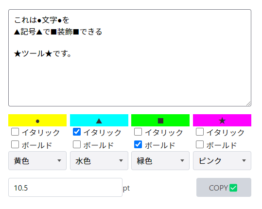
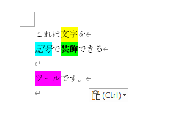

# Marker by symbol

↓

- Make html-string according to form control and copy to clipboard as rich-text content.
- Useful for adding multiple highlight on Microsoft Word.

---
- Vue 3 + TypeScript + Vite
- Thanks: [chota css framework](https://jenil.github.io/chota/)
